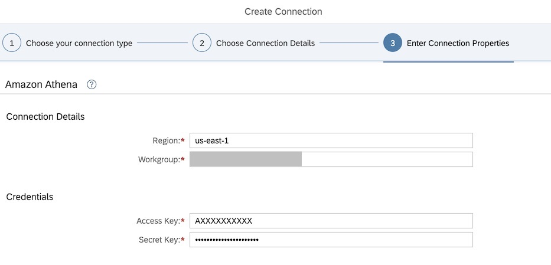

# Federating Queries from SAP Datasphere to Amazon S3 via Amazon Athena

This guide explains how to integrate SAP Datasphere with Amazon Athena to enable federated querying of CSV data stored in Amazon S3 without moving data out of SAP systems.

---

## Summary of Architecture

- **Amazon S3**: Stores raw CSV files.
- **Amazon Athena**: Acts as a query engine on top of S3 using SQL.
- **SAP Datasphere**: Connects to Athena to run live federated queries.

---

## Step 1: Prepare Input Data in Amazon S3

1. **Log in to the AWS Console** with an IAM user.
2. Navigate to **S3 service** → Create a bucket → Create a folder.
3. **Upload CSV files** to that folder.

4. After uploading, go to the **object's Properties tab** and **copy the S3 folder path** — you'll need this for table definition in Athena.

---

## Step 2: Configure Amazon Athena

### 2.1 Launch Athena

- Go to **Services → Athena**
- Click **Get Started**

### 2.2 Create a Workgroup

- Create a new **Workgroup** (you can also use `primary`)
- Switch to the new workgroup.


### 2.3 Define Tables

**Option 1: Use Athena Query Editor**

```sql
CREATE EXTERNAL TABLE `salesdata`(
  `region` string,
  `country` string,
  `itemtype` string,
  `saleschannel` string,
  `orderpriority` string,
  `orderdate` string,
  `orderid` string,
  `shipdate` string,
  `unitssold` int,
  `unitprice` float,
  `unitcost` float,
  `totalrevenue` double,
  `totalcost` double,
  `totalprofit` double
)
ROW FORMAT DELIMITED 
  FIELDS TERMINATED BY ',' 
STORED AS INPUTFORMAT 'org.apache.hadoop.mapred.TextInputFormat' 
OUTPUTFORMAT 'org.apache.hadoop.hive.ql.io.HiveIgnoreKeyTextOutputFormat'
LOCATION 's3://your-bucket/dataset/sales_data'
TBLPROPERTIES ('has_encrypted_data'='false');
```
## Option 2: Use Glue Crawler & UI Wizard

- Click **Connect data source** and proceed through:
  - **Default data source**
  - **Glue catalog** or **manual table definition**
  - **Input format**: CSV
  - Define columns **manually** or in **bulk**


---

## 2.4 Validate Setup

- Open **Athena Query Editor** and test queries on your newly created table.

---

## 2.5 Prepare for Datasphere Integration

### Create an IAM User

- Create a new **IAM user** for SAP Datasphere with **programmatic access**.
- Assign the following permissions:
  - `AmazonS3ReadOnlyAccess`
  - `AmazonAthenaFullAccess`
  - `AWSGlueConsoleFullAccess`
- Save the generated **Access Key** and **Secret Key**.

### Download SSL Certificates

- **AWS root CA** (.pem file)

- **Baltimore CyberTrust Root CA** (via S3 Object URL in browser)

---

## Step 3: Set Up SAP Datasphere Connection

### 3.1 Upload SSL Certificates

In SAP Datasphere:

- Go to **Configuration → Security**
- Upload both:
  - AWS root CA
  - S3 Baltimore certificate
  

### 3.2 Create Amazon Athena Connection

- Go to **Space Management → Connections**
- Click **+ → Amazon Athena**

- Provide the following:
  - **Region** of Athena
  - **Workgroup** name
  - **Access Key** and **Secret Key**
- Click **Validate** to confirm the connection


---

## Step 4: Build Models in SAP Datasphere

### 4.1 Create Virtual Table from Athena

- Open **Data Builder**
- Create a new **SQL View**
- Drag the Athena table to the canvas (it becomes a **virtual table**)
- Save and deploy the view


### 4.2 Create Local Table

- Define a **SAP HANA local table** inside Datasphere
- This table represents your internal SAP business data

### 4.3 Join & Analyze

- Create a **JOIN** view between the local and virtual (Athena) tables
- Build an **Analytical Model** or **Story**
- Deploy the model for interactive analysis


---

## Observations & Monitoring

- Federated queries run from SAP Datasphere are logged in **Athena Query History**
- Use the Athena console to monitor:
  - Query performance
  - Query cost
  - Usage patterns

---

## Benefits

- **No data replication** – query live S3 data through Athena
- **Reduced cost** – no ETL or storage duplication required
- **Fast insights** – combine SAP and external data instantly
- **Enterprise-grade security** – IAM roles and TLS certificate authentication

---

## Further Resources

- [SAP Discovery Center Mission – Athena Integration](https://discovery-center.cloud.sap/missiondetail/3401/3441)
- For questions, contact: `ci_sce@sap.com`
