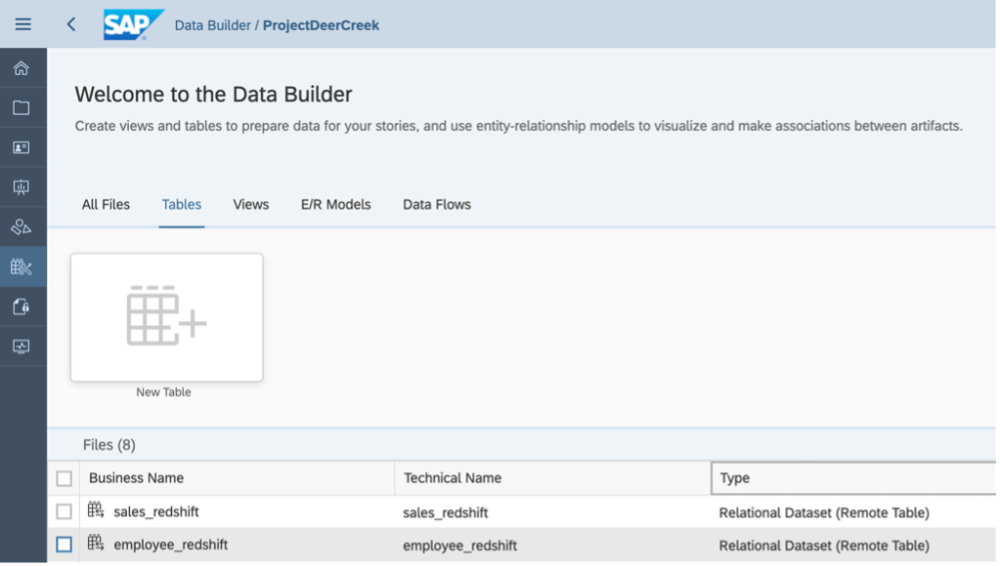

# Data Federation Between SAP Datasphere and Amazon Redshift

This guide explains how to create a **data federation** between **Amazon Redshift** and **SAP Datasphere ** using **SAP Smart Data Integration (SDI)** with the **Camel JDBC Adapter**.

---

## Prerequisites

- An active **Amazon Redshift** instance with external access enabled.
- A running **SAP Datasphere** tenant.
- **SAP Smart Data Integration (SDI) DP Agent** installed on a supported system.

---

## System Architecture

The integration relies on:
- SAP Datasphere's **On-Premise Agent**
- **DP Agent** with Camel JDBC Adapter
- **JDBC driver** for Amazon Redshift

---

## Step 1: Create On-Premise Agent in SAP Datasphere

1. In SAP Datasphere, navigate to:
System → Configuration → Data Integration → On-Premise Agents
2. Create a new **On-Premise Agent**.
3. **Note down the connection information** — it will be used during DP Agent configuration.

---

## Step 2: Set Up Amazon Redshift Access

1. From your Redshift instance dashboard in AWS, copy the **JDBC URL**.
- You will use this to connect from the DP Agent.

---

## Step 3: Configure SAP SDI DP Agent

### 3.1 Download and Install Redshift JDBC Driver

- Download the latest Redshift JDBC driver from:
[AWS Redshift JDBC Drivers](https://docs.aws.amazon.com/redshift/latest/mgmt/configure-jdbc-connection.html#download-jdbc-driver)

- Place the downloaded `.jar` file in: <DP_AGENT_INSTALL_DIR>\camel\lib

### 3.2 Configure Connection Using DP Agent Configuration Tool

1. Run the **DP Agent Configuration Tool**.
2. Select:
 - Option 6: **SAP HANA Connection**
 - Then Option 2: **Connection to SAP Datasphere via JDBC**
3. Use the **agent connection info** obtained from Step 1.

---

## Step 4: Register Camel JDBC Adapter in SAP Datasphere

1. Go to: Administration → Data Integration → On-Premise Agents

2. Locate your agent and click into it.
3. Enable and **register `CamelJdbcAdapter`**.
4. Click **Save**.

---

## Step 5: Upload Third-Party Drivers in SAP Datasphere

1. Go to: Administration → Data Integration → Third-Party Drivers

2. Upload the **Amazon Redshift ODBC/JDBC driver** if not already uploaded.

---

## Step 6: Create Local Connection to Redshift in SAP Datasphere

1. Navigate to: Space Management → <Your Space> → Connections → Local Connections
2. Create a new **Local Connection** for **Amazon Redshift** using the JDBC URL and credentials.

---

## Step 7: Import Remote Tables from Amazon Redshift

1. Use the connection you just created to **browse available Redshift schemas and tables**.
2. **Select and import** the remote tables.
3. These remote tables can now be:
- Used in **SQL views**
- Combined in **analytical datasets**
- Queried directly with **pushdown processing** to Redshift

> SAP SDI DP Agent handles query pushdown and returns results seamlessly to SAP Datasphere.

---

## Summary

This setup enables **live federated queries** from SAP Datasphere to Amazon Redshift without replicating the data. Benefits include:

- **Real-time access** to Redshift data
- **Pushdown queries** for performance optimization
- **No data duplication** in SAP Datasphere

---

## Questions?

For support, contact: **ci_sce@sap.com**

