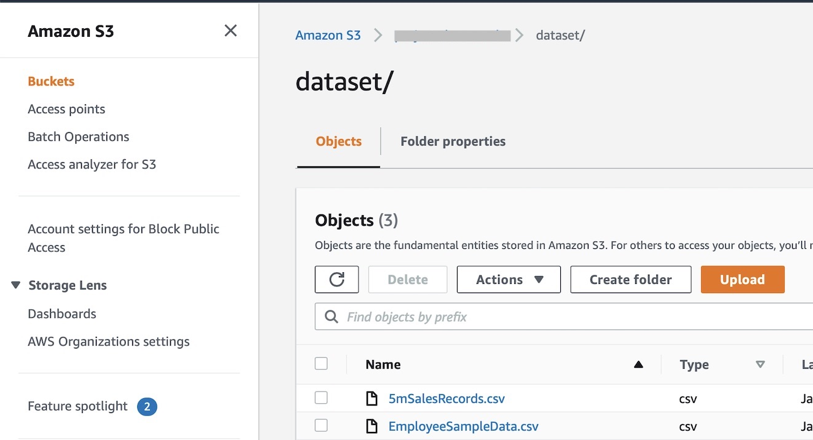

# Data Integration between SAP Datasphere and Amazon S3

This guide demonstrates how to integrate data between **SAP Datasphere** and **Amazon S3**, allowing you to blend SAP business data with external CSV files stored in a private S3 bucket.

---

## Step 1: Upload CSV File to Amazon S3

1. Log in to the **AWS Management Console**.
2. Navigate to the **S3 service**.
3. **Create a private S3 bucket** (or use an existing one).
4. Upload your **CSV data file** into the bucket.

---

## Step 2: Set Up IAM User with Programmatic Access

1. In **AWS IAM**, create a new **IAM user** with **Programmatic Access**.
2. Generate and save the **Access Key** and **Secret Key**.
3. Attach a policy to the user for S3 access. For testing purposes, full access was used:

```json
{
  "Version": "2012-10-17",
  "Statement": [
    {
      "Effect": "Allow",
      "Action": "s3:*",
      "Resource": "*"
    }
  ]
}
```


> In production environments, restrict this policy to the specific bucket and actions required.

---

## Step 3: Create S3 Connection in SAP Datasphere

1. Log in to **SAP Datasphere**.

2. Go to **Space Management → Your Space → Connections** tab.

3. Click **Create New Connection** and select **Amazon S3** as the connection type.


4. Fill in the required details:

   * **Access Key**
   * **Secret Key**
   * **Region**
   * **Bucket Name**


5. After creating the connection, click **Validate** to check connection status.

---

## Step 4: Create a Data Flow

1. In **SAP Datasphere**, go to **Data Builder** and create a **new Data Flow**.

2. Select the **Amazon S3 connection** created in Step 3 as the **data source**.
3. Browse and explore the contents of your S3 bucket.
4. **Drag the CSV file** into the data flow canvas as a source object.

5. Proceed with your transformation or mapping logic as needed.

---

## Summary

This process allows SAP Datasphere to:

* Directly connect to Amazon S3.
* Access external CSV data.
* Use that data in combination with internal SAP datasets via Data Flows.

You can repeat this integration pattern for other external sources as well. SAP Datasphere supports a wide variety of connectors for hybrid data blending scenarios.

---

## Questions?

If you have any questions, please reach out to: **[ci\_sce@sap.com](mailto:ci_sce@sap.com)**
