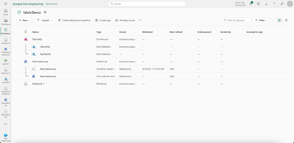
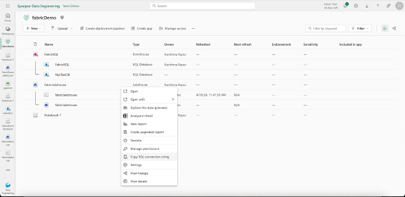
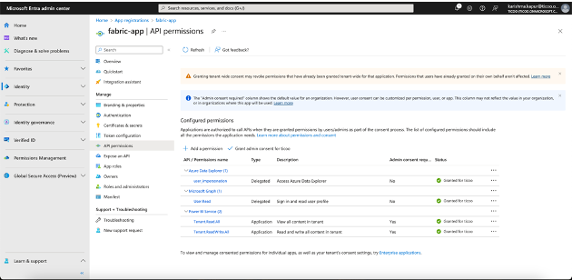
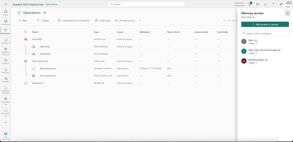
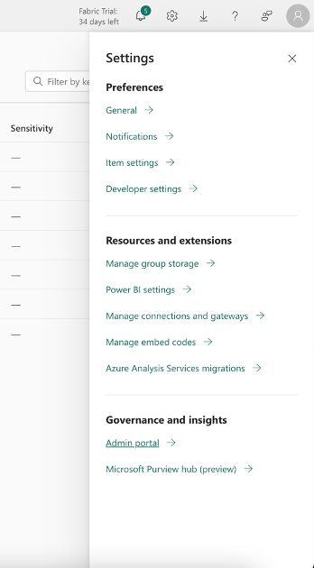
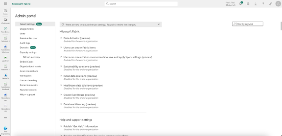
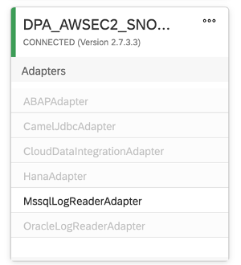
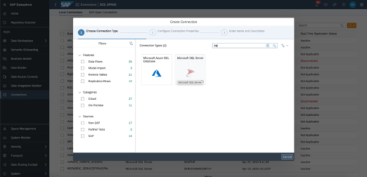
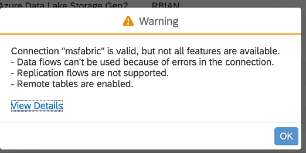

# Connecting Microsoft Fabric (Synapse Warehouse or Lakehouse) to SAP Datasphere

## Overview

Microsoft Fabric’s **Synapse Data Warehouse** and **Lakehouse (OneLake)** both expose a **SQL analytics endpoint**. This endpoint is compatible with **Microsoft SQL Server (MSSQL)** and can be federated into **SAP Datasphere** using the **Data Provisioning Agent (DP Agent)** with the **MSSQL adapter**.

Whether you are using a dedicated **Synapse Data Warehouse** or a **Lakehouse** built on OneLake, the connection process is the same.

---

## Prerequisites

- A **Microsoft Fabric** workspace (non-default)
- A **Lakehouse** or **Warehouse** with data exposed via the SQL analytics endpoint
- **Azure Entra ID** service principal created (or developer login)
- **SAP Datasphere** tenant
- **DP Agent** installed and configured with the MSSQL adapter

## Steps

1. **Get SQL Endpoint:**
   - Go to your Lakehouse or Warehouse workspace
   - Copy the **SQL analytics endpoint** connection string


2. **Create a Service Principal in Azure Entra ID:**
   - Register an application
   - Generate a **Client Secret**
   - Note the **App ID** and **Secret**

3. **Assign API Permissions:**
   - Power BI Service:
     - `Read.All`
     - `ReadWrite.All`
   - Grant **Admin Consent**
   

4. **Add Principal to Fabric Workspace:**
   - Add it as an **Admin** user
   

5. **Enable Fabric Admin Portal Policies:**
   - Service principals can:
     - Use Fabric APIs
     - Access read-only admin APIs
     - Create and use profiles
     - Access OneLake externally
     
     

6. **Create the MSSQL Connection in SAP Datasphere:**
    
    
   - Type: MS SQL Server
   - Host: SQL analytics endpoint
   - Port: `1433`
   - Database: Name of your Lakehouse or Warehouse
   - Username: App ID
   - Password: Secret
   - JDBC Properties:
     ```text
     authentication=ActiveDirectoryServicePrincipal
     ```

---

7. **Validate the Connection**

You will now be able to access **remote tables** from your Fabric Synapse Lakehouse or Warehouse directly in SAP Datasphere.

