# Federating queries to Databricks from SAP Datasphere for real-time analytics in SAP Analytics Cloud

---

For many companies, data strategy may involve storing business data in independent silos at different repositories. Some of that data may even cross different cloud sources (for cost and other reasons) which brings along new challenges with data fragmentation, data duplication and loss of data context.

**SAP Datasphere** helps bridge siloed and cross-cloud SAP and non-SAP data sources, enabling businesses to get richer business insights — all while keeping the data at its original location and eliminating the need to duplicate data and time-consuming ETLs.

**Databricks Lakehouse** is a popular cloud data platform used for housing business, operational, and historical data in its delta lakes and data lakehouses.

In this document, let’s see how to do unified analytics on SAP Analytics Cloud by creating unified business models that combine federated non-SAP data from Databricks with SAP business data to derive real-time business insights.

## SAP and Databricks Integration Reference Architecture
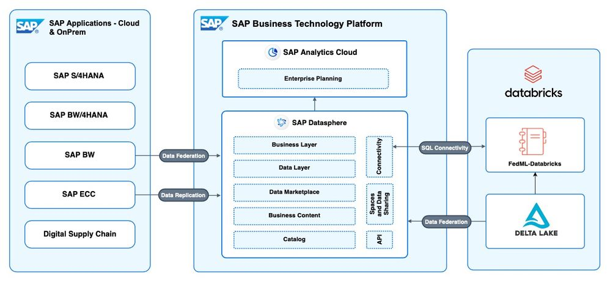

The integration of Databricks and SAP BTP (Business Technology Platform) can be summarized in five simple steps:

### Step 1: Identify the source delta lake data in Databricks

We will federate IoT data from Databricks delta lake and combine it with product master data from SAP sources.
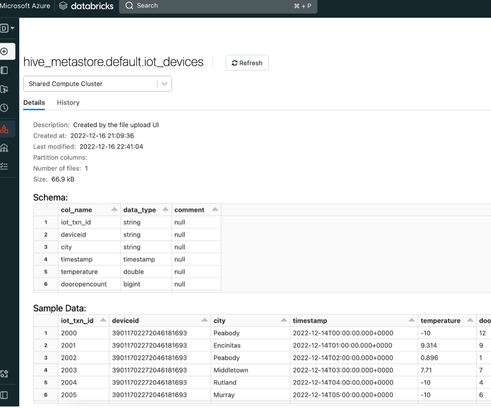

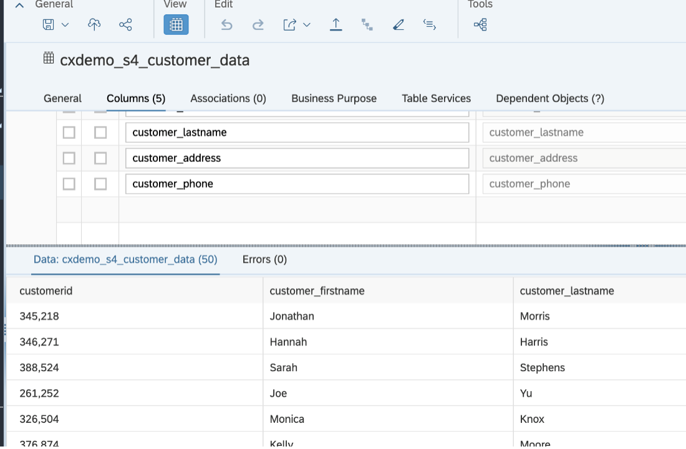

### Step 2: Prepare to connect Databricks to SAP Datasphere

1. Go to your **Databricks SQL Warehouse**, open the **Connection details** tab, and copy the JDBC URL.
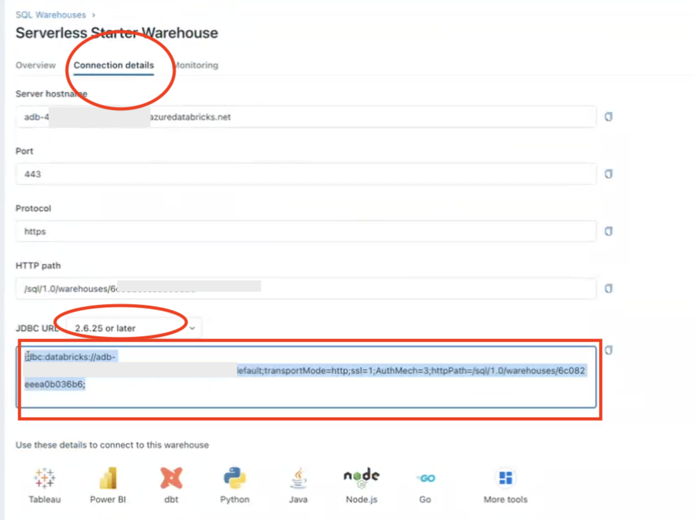

2. Go to **User settings → Generate New Token**, copy & note the token.
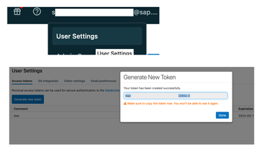

> **Note:** This tutorial uses user-based personal tokens. For production, prefer service principal or OAuth2.0 tokens.

3. Rewrite the JDBC string removing `uid` and `PWD`, and add:

```
jdbc:databricks://adb-<id>.19.azuredatabricks.net:443/default;
transportMode=http;ssl=1;AuthMech=3;httpPath=/sql/1.0/warehouses/<id>;
IgnoreTransactions=1;UseNativeQuery=0;UserAgentEntry=sap+datasphere
```

> **Note:** If using Unity Catalog, append: `;ConnCatalog=<Catalog Name>`

### Step 3: Connect Databricks as a source in SAP Datasphere

* Ensure the **Data Provisioning Agent** is installed and can reach the Databricks cluster.

* Download the **Databricks JDBC driver** and copy to `camel/lib`.

* Edit `<DPAgent_root>/camel/configfile-jdbc.properties` and add:

  ```
  delimident=BACKTICK
  ```

* Restart the DP Agent.

* Register and enable `CamelJDBCAdapter` in SAP Datasphere.

* In **SAP Datasphere → Connections**, create a **Generic JDBC connection**:

  * Username: `token`
  * Password: `<token from Databricks>`

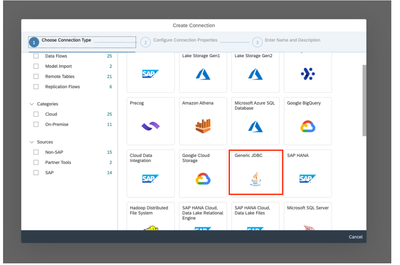
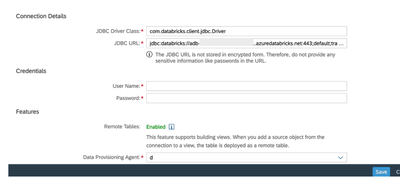

* Create a remote table in SAP Datasphere to point to a Databricks table. Preview to confirm data loads.
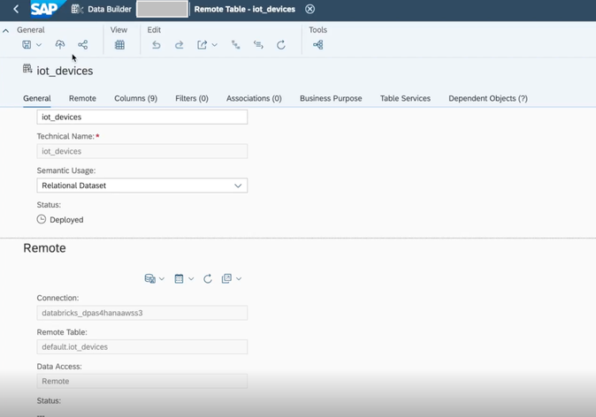

### Step 4: Create unified semantic Fact model

Create a **Fact model** in SAP Datasphere that joins live SAP and Databricks data. 
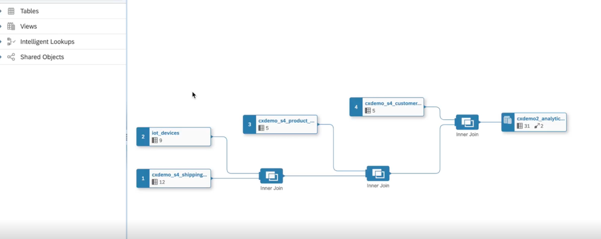

Confirm live query pushdowns in **Log4j logs** when previewing the data.
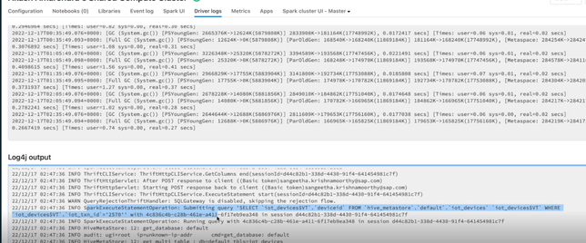

### Step 5: Connect SAP Analytics Cloud to the unified data model

Visualize real-time data in SAP Analytics Cloud:

* For example, a dashboard showing real-time **truck and shipment status**:

  * Live IoT data from Databricks delta lake
  * Customer and shipment master data from SAP
  * All joined in one unified model for real-time analytics

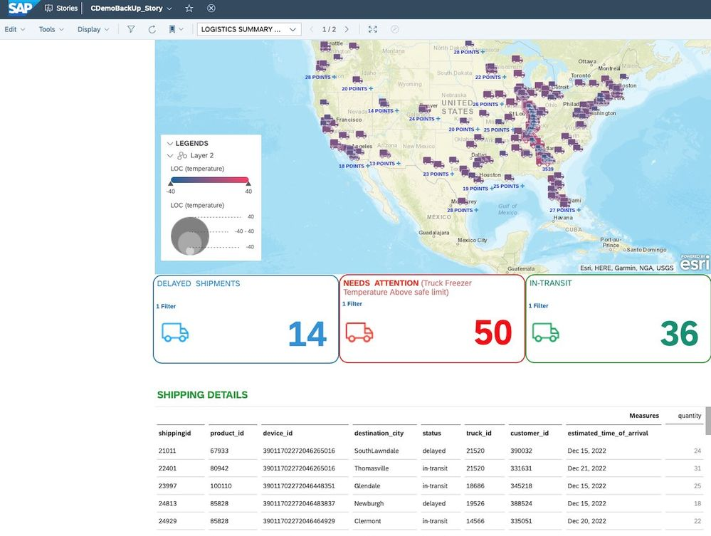

---

## Conclusion

We hope this tutorial helps in your data journey and in exploring SAP Datasphere’s new features. We'd love to hear your feedback — please leave a comment or a like!

Read the [blog](https://community.sap.com/t5/technology-blog-posts-by-sap/using-fedml-library-with-sap-datasphere-and-databricks/ba-p/13568923) to learn about using the **FedML-Databricks** library for federating live data for machine learning.

---

**Contact:** [paa@sap.com](mailto:paa@sap.com)
