# Data Federation Between SAP Datasphere (DSP) and Google BigQuery

---

Explosion of data is enabling enterprises to get new insights into their business. But it also brings challenges like data fragmentation. Cloud adoption has allowed LoBs to choose their preferred data storage, increasing fragmentation. **SAP Datasphere** helps bridge these silos across multiple cloud providers.

> 💡 Start data federation from Google BigQuery through SAP Datasphere
 via a free mission in [SAP Discovery Center](https://discovery-center.cloud.sap/missiondetail/3409/3449/) for a step-by-step guide.
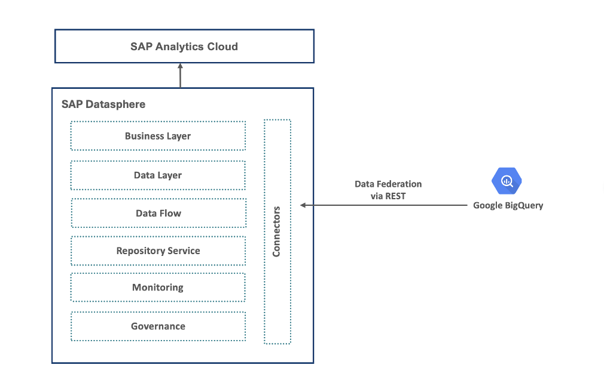

This guide focuses on **integrating Google BigQuery with SAP Datasphere**.

---

## 1. Loading Data to BigQuery

**Google BigQuery** is a big data service on the Google Cloud Platform.

- Create a new dataset called `sample_dataset`.
- Click **Create Table**.
- On the table creation page:
  - Enter table name
  - Select a sample CSV file
  - Click **Create Table**

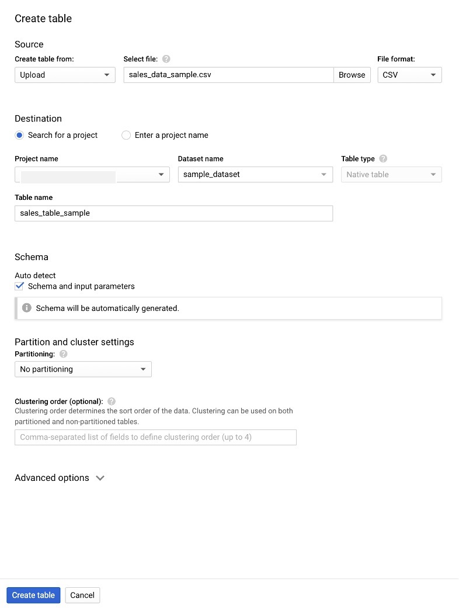

BigQuery automatically infers the table schema from your CSV.

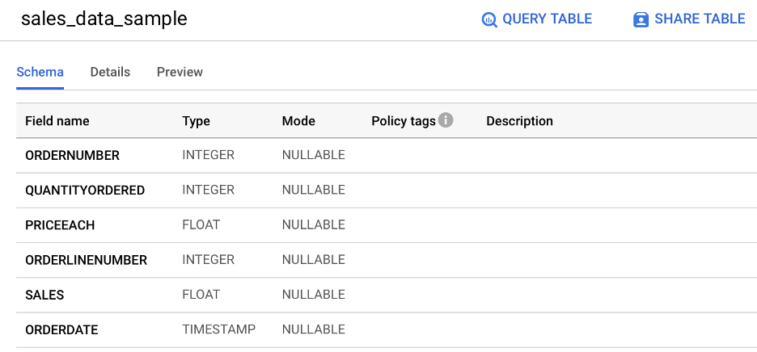

---

## 2. Creating Service Accounts in GCP

SAP Datasphere requires a **GCP service account** with appropriate roles.

- In GCP Console:  
  Navigate to **IAM → Service Accounts** → Click **Create Service Account**
- Enter account name → Click **Create**

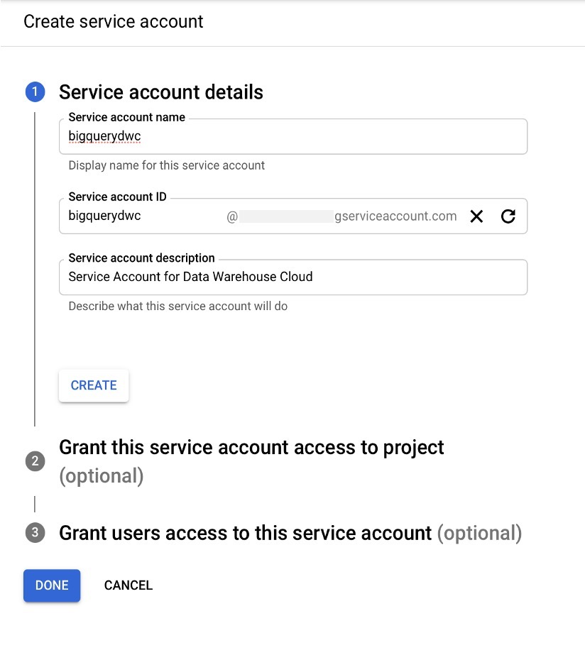

- Assign the following roles:
  - `BigQuery User`
  - `BigQuery Data Viewer`

  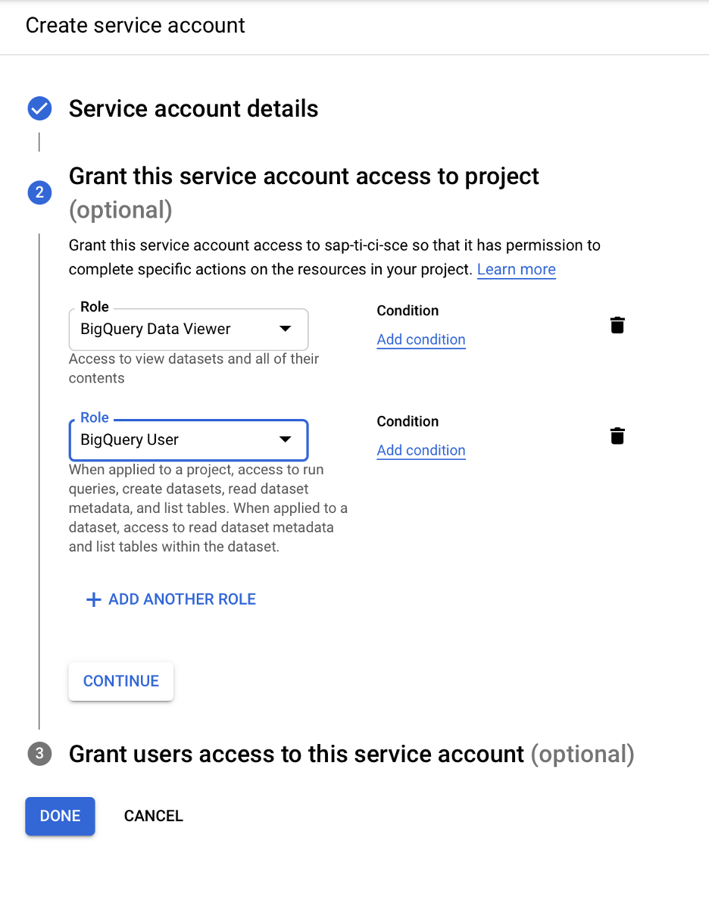

- After creation:
  - Generate a **private key**
  - Download the key (JSON file)

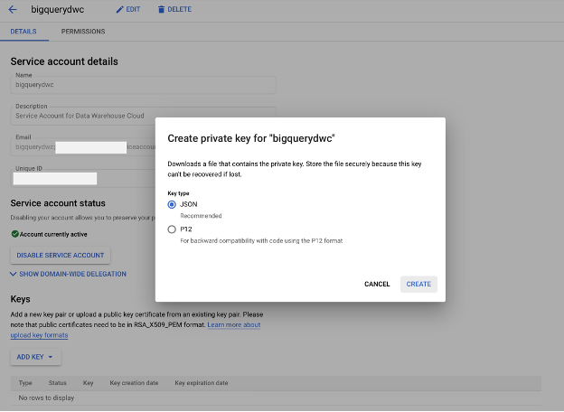

---

## 3. Installing Certificate

- Go to `google.com` in your browser.
- Open the site certificate → Drag to desktop.
- Import it to **Keychain Access**.
- Export as a `.pem` file.

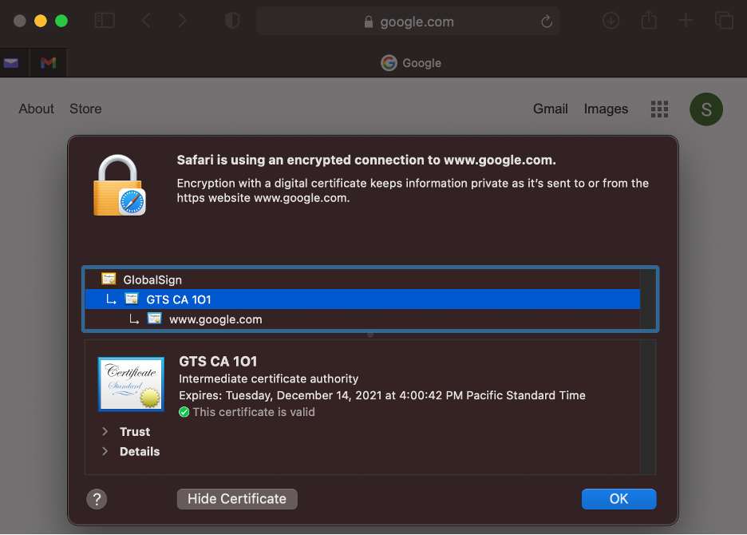

Then:
- Open **SAP Datasphere**
- Navigate to **Administration → Security → Add Certificate**
- Upload the `.pem` certificate

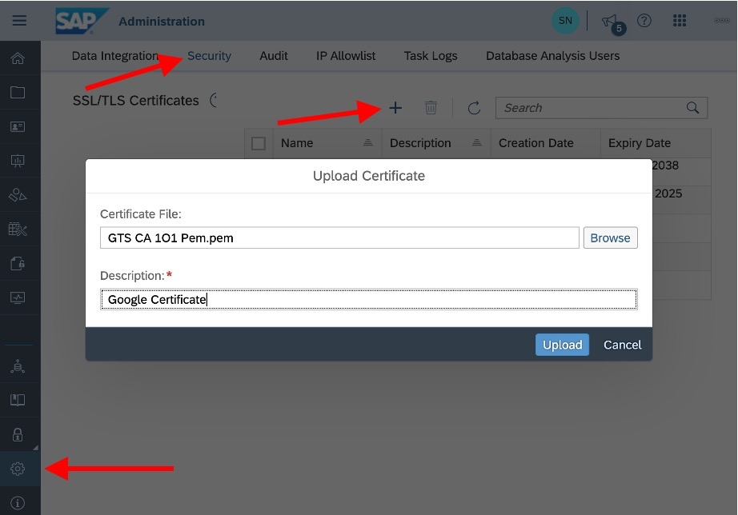

---

## 4. Creating Google BigQuery Connection

- Go to **Space Management** → Select your space
- Scroll to the **Connections** section → Click **Add Connection**

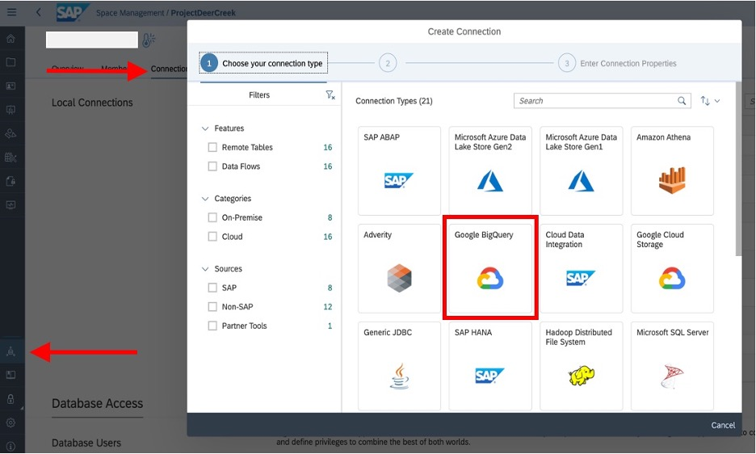

- Enter your GCP project ID
- Upload the private key (JSON file) created earlier
- Click **Create Connection**

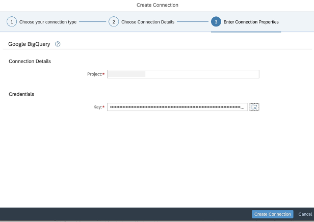

---

## 5. Creating Remote Table

- Open **Data Builder** → Click **Create New SQL View**
- From **Sources**, open the Google BigQuery connection
- Navigate to your **Project → Dataset → Table**
- Drag the table into the SQL editor
- Add columns to the SQL
- Save and **Deploy** the view

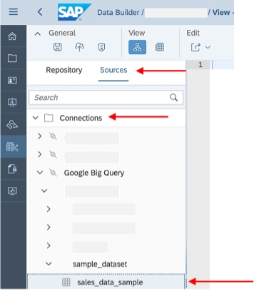

SAP DSP now creates a **virtual table** (relation table) pointing to BigQuery. Queries are delegated live to BigQuery; data is not stored in SAP DSP.

---

## 6. Create Analytical Dataset

- In **Data Builder**, create a new **Analytical Dataset**
- Drag in the remote table
- Add **measures** and **dimensions**
- Save and **Deploy** the dataset

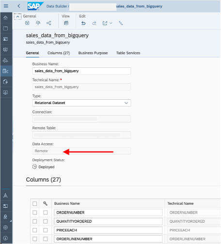

---

## 7. Test in SAP Analytics Cloud

- Open **SAP Analytics Cloud**
- Create a new **Story**
- Use the Analytical Dataset as a source
- Build visualizations (charts, tables, etc.)

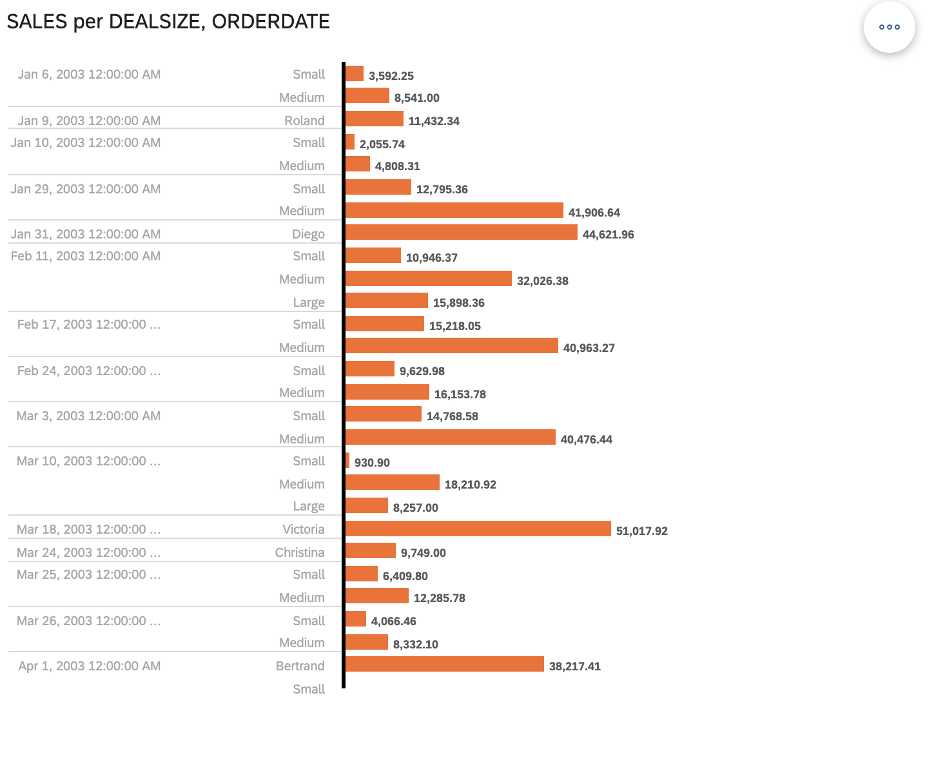

> 🔍 All queries are delegated live to BigQuery through SAP Datasphere, enabling real-time federated analytics.

---

## Conclusion

Enterprises can now visualize data stored in **Google BigQuery** directly within **SAP Analytics Cloud** using **SAP Datasphere’s** federation capabilities — without duplicating data.

---
