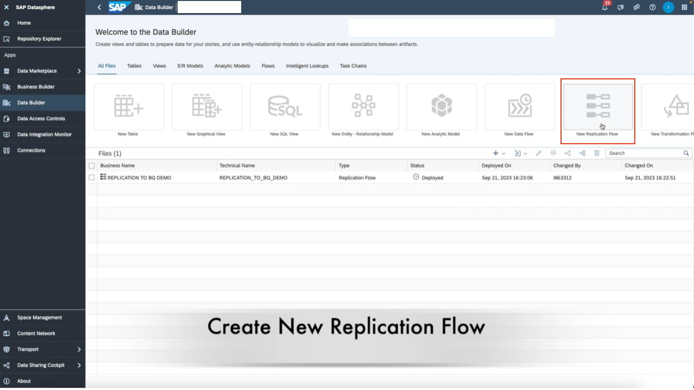

# Replication Flows – SAP Datasphere and Google BigQuery

---

## Background

SAP Datasphere introduced **Replication Flows** starting with version **2021.03**. This feature enables fast and seamless copying of multiple tables from a source system to a target system.

> 📖 For more details on replication flows, please refer to the official documentation.

This guide demonstrates how to replicate data from **SAP sources** to **Google BigQuery**.

---

## Steps

1. **Create a Connection in SAP Datasphere to Google BigQuery**  
   - Follow Step 4: *"Creating Google BigQuery Connection"* from [this link](https://github.tools.sap/I542957/Explore-your-Hyperscaler-data-with-SAP-DSP/blob/main/GCP/bigquery-data-federation.md) for a detailed walkthrough.

2. **Ensure You Have a Dataset in BigQuery**  
   - Create a dataset where replicated tables will be stored.

3. **Ensure You Have a Source Connection in BigQuery**
   - Go to **Connections** in SAP Datasphere.
   - Set up a connection to your SAP source (e.g., S/4HANA Cloud).

4. **Start a New Replication Flow**  
   - In SAP Datasphere, navigate to **Data Builder**.
   - Click on **New Replication Flow**.

5. **Select Source Connection**  
   - Choose the source connection (e.g., S/4HANA Cloud).

6. **Select Source connection**  
   - Choose **SAP S4 HANA**.

7. **Select Source Container**  

8. **Choose CDS Extraction**  
   - **CDS Views Enabled for Extraction**.
   - Click **Select**.

9. **Add Source Objects**  
   - Click **Add Source Objects** and select the CDS Views to replicate.
   - You can select multiple views. Click **Add Selection** once finalized.

10. **Select Target Connection**  
   - Choose **Google BigQuery** as the target.
   - (💡 *If errors occur, see the note at the end.*)

11. **Choose Target Container**  
   - Select the BigQuery dataset created in step 2.

12. **Set Load Type**  
    - Click the middle **Settings** section.
    - Choose between:
      - `Initial` – one-time full load
      - `Initial and Delta` – full load + periodic (every 60 minutes) delta updates

13. **Edit Projections (Filters & Mapping)**  
    - Click the **Edit Projections** icon on the top toolbar.
    - Set any **filters** or **field mappings** as needed.  
      (📖 [More on filters](https://help.sap.com/docs/SAP_DATASPHERE/c8a54ee704e94e15926551293243fd1d/5a6ef36765c54a6a950a6bd6c070501d.html) | [More on mapping](https://help.sap.com/docs/SAP_DATASPHERE/c8a54ee704e94e15926551293243fd1d/2c7948fdd1a14105a27d0c03af82a56b.html))

14. **Modify Write Settings (Optional)**  
    - Use the **Settings** icon next to the target connection name to adjust target write behavior.

15. **Finalize and Run Replication Flow**  
    - Rename the replication flow via the **right details panel**.
    - Click **Save**, then **Deploy**, and finally **Run** using the top toolbar.
    - Monitor the replication in **Data Integration Monitor** on the left panel.

16. **View Target Tables in BigQuery**  
    - Once replication completes, you’ll see the replicated tables in BigQuery.
    - Each table will include three additional columns for delta tracking:
      - `operation_flag`
      - `recordstamp`
      - `is_deleted`

> ⚠️ **Note:** You may need to include the **Premium Outbound Integration** block in your SAP Datasphere tenant to deploy replication flows.

---

## Conclusion

You’ve now successfully created a **replication flow** from **SAP S/4HANA Cloud** to **Google BigQuery** using **SAP Datasphere**.

If you have questions, feel free to leave a comment below. Thank you!
